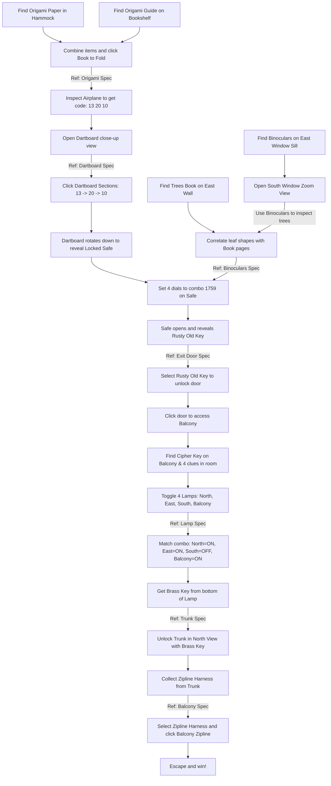

# Escape the Treehouse - Master Game Plan

This document serves as the high-level roadmap, design overview, and session reference for developing **Escape the Treehouse**.

---

## 📖 Plot & Goal
*   **Setting:** A cozy, sunlit treehouse nestled high in the forest canopy. Warm sunlight filters through rustling green leaves, illuminating wooden planks, a hammock, bookshelves, and various curious items.
*   **Intro Text:** *"You wake up in a cozy, sunlit treehouse. The wind rustles the leaves outside. The door is locked, and the ladder down is nowhere to be seen. You need to find another way down to the forest floor."*
*   **Goal:** Solve the series of puzzles to acquire the key, unlock the exit door, and escape to victory.

---

## 🗺️ Puzzle Flowchart

The following flowchart shows the progression of puzzles. Click a puzzle node to see its detailed specification.



---

## 📂 Puzzle Specifications
Each active puzzle is modularized and detailed in its own specification file under the `specs/` directory:

1.  **[Origami Folding Spec](file:///home/moltmans/escape-the-treehouse/specs/origami_folding.md):** Details finding the origami materials, the custom folding combination zone mechanics, and creating the paper airplane.
2.  **[Dartboard Puzzle Spec](file:///home/moltmans/escape-the-treehouse/specs/dartboard_puzzle.md):** Details opening the dartboard zoom, solving the combination `13 -> 20 -> 10`, and revealing the Safe behind the dartboard.
3.  **[Binoculars & Trees Spec](file:///home/moltmans/escape-the-treehouse/specs/binoculars_puzzle.md):** Details finding the binoculars and the trees book, and inspecting the canopy trees using binoculars through the south window to solve the combination.
4.  **[Safe Puzzle Spec](file:///home/moltmans/escape-the-treehouse/specs/safe_puzzle.md):** Details opening the safe input zoom, rotating the dials to combination `1759`, unlocking the safe, and retrieving the Rusty Old Key.
5.  **[Exit Door Spec](file:///home/moltmans/escape-the-treehouse/specs/exit_door.md):** Details using the key on the exit door padlock and opening access to the Balcony.
6.  **[Lamp Spec](file:///home/moltmans/escape-the-treehouse/specs/lamp_puzzle.md):** Details finding combination clues, setting the correct lamp states, and revealing the brass key.
7.  **[Trunk Spec](file:///home/moltmans/escape-the-treehouse/specs/trunk_puzzle.md):** Details the trunk mechanics, unlocking it with the brass key, and retrieving the zipline harness.
8.  **[Balcony Escape Spec](file:///home/moltmans/escape-the-treehouse/specs/balcony_escape.md):** Details the balcony view layout, collecting the cipher key translation note, and escaping via the zipline.

For details on ideas and mechanics deferred to later phases, see [updates-for-later.md](file:///home/moltmans/escape-the-treehouse/updates-for-later.md).

---

## 🖼️ Environment & Views
The game is a point-and-click escape room containing multiple navigation angles (views):
*   **North (Cozy Corner):** Hammock (origami paper), bookshelves (origami guide), a decorative wooden trunk (contains zipline harness), a stack of books under a mug (hides Clue 4), and the North Lamp (Spiral).
*   **East (The Window):** A large circular window looking out into the forest canopy, the Binoculars sitting on the window sill, a "Trees of North America" book on the top left wall, a painting (hides Clue 1), a bed mattress (hides Clue 2), and the East Lamp (Triangle).
*   **South (The Desk & Wall):** A cozy writing desk (holds Clue 3), the south window, the dartboard (revealing the hidden safe behind it), the locked exit door (leads to Balcony), and the South Lamp (Circle).
*   **Balcony (Outside):** A wooden balcony overlooking the forest canopy, a Zipline escape route, a pinned note on the wall (Pigpen Cipher Key), and the Balcony Lamp (Cross).

---

## 🖱️ Selected Item Cursors
Custom cursor overrides have been removed to ensure maximum compatibility in headless testing environments. The game uses standard browser pointers and hand cursors.

---

## 🛠️ Technical Stack & Architecture

### Tech Stack
*   **Decoupled Logic Core:** Platform-agnostic JavaScript state and rule evaluator.
*   **Rendering Shell:** Phaser 3 (handles asset loading, rendering, animations, and inputs).
*   **Build Tool:** Vite (for development server and production build).
*   **Testing:** Playwright (E2E verification of UI flows) + Vitest (headless unit testing of logic).
*   **Styling:** Vanilla CSS.

### Key Files
*   **Headless State:** [src/engine/StateManager.js](file:///home/moltmans/escape-the-treehouse/src/engine/StateManager.js) (maintains state, emits events, executes action commands).
*   **Logic Interpreter:** [src/engine/Interpreter.js](file:///home/moltmans/escape-the-treehouse/src/engine/Interpreter.js) (evaluates logic rules headlessly).
*   **Game Configuration:** [src/game/treehouse.config.js](file:///home/moltmans/escape-the-treehouse/src/game/treehouse.config.js) (hotspots, dimensions, views, interaction chains, minigame criteria).
*   **Visual Interface:** [src/main.js](file:///home/moltmans/escape-the-treehouse/src/main.js) (Phaser-specific rendering engine, animations, and input listeners).
*   **Style sheet:** [src/style.css](file:///home/moltmans/escape-the-treehouse/src/style.css).
*   **Unit Tests:** [tests/engine.test.js](file:///home/moltmans/escape-the-treehouse/tests/engine.test.js) (headless logic verifications).
*   **E2E Tests:** [tests/escape.spec.js](file:///home/moltmans/escape-the-treehouse/tests/escape.spec.js) (full walkthrough and interface assertions).

---

## 💾 Decoupled Game State Structure
For reference during development, game state is stored inside `stateManager.state`. A window-level compatibility proxy `window.__gameState` maps directly to this structure in [src/main.js](file:///home/moltmans/escape-the-treehouse/src/main.js):

```javascript
const state = {
  inventory: [],               // Array of strings (e.g., 'origami_paper', 'origami_book')
  selectedItem: null,          // String representing the active selected inventory item (or null)
  solvedPuzzles: new Set(),    // Set containing flags (e.g., 'dartboard_solved', 'safe_unlocked', 'found_paper')
  currentView: 'north',        // Active view: 'north', 'east', 'south'
  zoomView: null,              // Active zoom view identifier (or null if looking at main room)
  dialogText: '',              // Dialogue text displayed in the message box
  dialogActive: false,         // Boolean indicating whether a dialog box is overlaying interaction
  hasKeyInCompartment: true    // Boolean indicating if the rusty_key is still inside the safe
};
```

---

## 🧪 Testing & Verification commands

To run all unit tests for the headless core engine:
```bash
npm run test:unit
```

To verify the full point-and-click walkthrough using E2E Playwright:
```bash
npm run test:e2e
```

Or run individual Playwright UI tests:
```bash
npx playwright test --ui
```