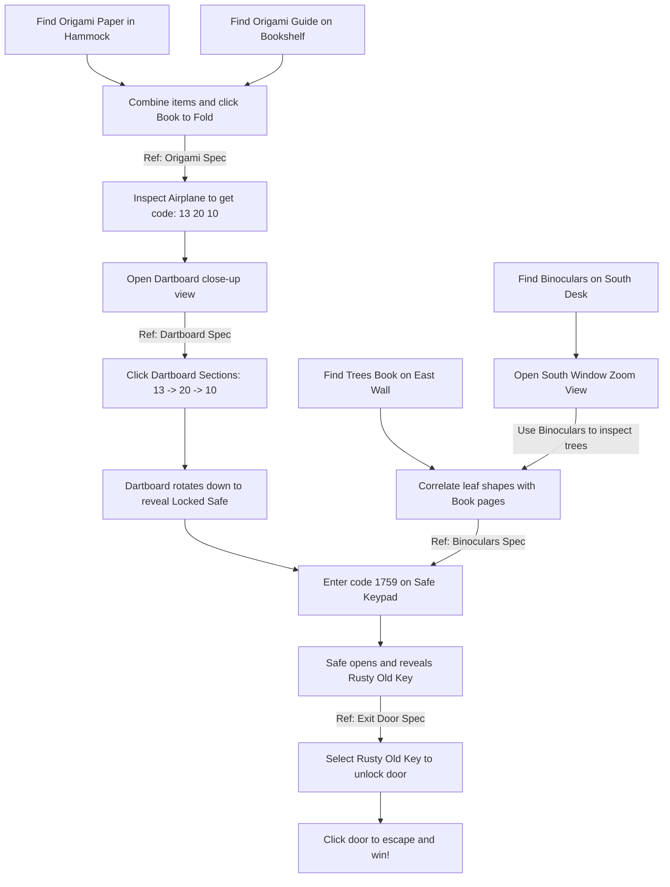

# Escape the Treehouse - Master Game Plan

This document serves as the high-level roadmap, design overview, and session reference for developing **Escape the Treehouse**.

---

## 📖 Plot & Goal
*   **Setting:** A cozy, sunlit treehouse nestled high in the forest canopy. Warm sunlight filters through rustling green leaves, illuminating wooden planks, a hammock, bookshelves, and various curious items.
*   **Intro Text:** *"You wake up in a cozy, sunlit treehouse. The wind rustles the leaves outside. The door is locked, and the ladder down is nowhere to be seen. You need to find another way down to the forest floor."*
*   **Goal:** Solve the series of puzzles to acquire the key, unlock the exit door, and escape to victory.

---

## 🗺️ Puzzle Flowchart

The following flowchart shows the progression of puzzles. Click a puzzle node to see its detailed specification.



---

## 📂 Puzzle Specifications
Each active puzzle is modularized and detailed in its own specification file under the `specs/` directory:

1.  **[Origami Folding Spec](file:///home/moltmans/escape-the-treehouse/specs/origami_folding.md):** Details finding the origami materials, the custom folding combination zone mechanics, and creating the paper airplane.
2.  **[Dartboard Puzzle Spec](file:///home/moltmans/escape-the-treehouse/specs/dartboard_puzzle.md):** Details opening the dartboard zoom, solving the combination `13 -> 20 -> 10`, and revealing the Safe behind the dartboard.
3.  **[Binoculars & Trees Spec](file:///home/moltmans/escape-the-treehouse/specs/binoculars_puzzle.md):** Details finding the binoculars and the trees book, inspecting the canopy trees using binoculars through the south window, and unlocking the safe behind the dartboard with code `1759`.
4.  **[Exit Door Spec](file:///home/moltmans/escape-the-treehouse/specs/exit_door.md):** Details using the key on the exit door padlock and completing the game.

For details on ideas and mechanics deferred to later phases, see [updates-for-later.md](file:///home/moltmans/escape-the-treehouse/updates-for-later.md).

---

## 🖼️ Environment & Views
The game is a point-and-click escape room containing multiple navigation angles (views):
*   **North (Cozy Corner):** Hammock (origami paper), bookshelves (origami guide), and a decorative wooden trunk.
*   **East (The Window):** A large circular window looking out into the forest canopy, and a "Trees of North America" book on the top left wall.
*   **South (The Desk & Wall):** Desk (binoculars), the south window, the dartboard (revealing the hidden safe behind it), and the locked exit door.

---

## 🖱️ Selected Item Cursors
When an inventory item is active/selected (i.e. `gameState.selectedItem` is not null), the mouse cursor style updates to reflect that item:
*   Selecting `binoculars` updates the cursor style to look like binoculars.
*   Selecting `origami_paper` or `paper_airplane` updates the cursor to a paper sheet/airplane graphic.
*   Selecting `trees_book` or `origami_book` updates the cursor to a book icon.
*   Selecting `rusty_key` updates the cursor to a key.
*   Deselecting the item or closing the zoom views resets the cursor to the default pointer/hand icon.

---

## 🛠️ Technical Stack & Architecture

### Tech Stack
*   **Engine:** Phaser 3 (for canvas rendering, input handling, and assets).
*   **Build Tool:** Vite (for development server and production build).
*   **Testing:** Playwright (for E2E verification of state and UI flows).
*   **Styling:** Vanilla CSS.

### Key Files
*   **Code base:** [src/main.js](file:///home/moltmans/escape-the-treehouse/src/main.js) (contains all scenes, layout, game loop, and event handling).
*   **Style sheet:** [src/style.css](file:///home/moltmans/escape-the-treehouse/src/style.css) (custom Outfit/Playfair fonts and page layout).
*   **E2E Tests:** [tests/escape.spec.js](file:///home/moltmans/escape-the-treehouse/tests/escape.spec.js) (fully automates the walkthrough and state assertions).

---

## 💾 Global Game State Structure
For reference during development sessions, here is the structure of the `gameState` object managed in [src/main.js](file:///home/moltmans/escape-the-treehouse/src/main.js#L4-L16):

```javascript
const gameState = {
  inventory: [],               // Array of strings (e.g., 'origami_paper', 'origami_book', 'paper_airplane', 'binoculars', 'trees_book', 'rusty_key')
  selectedItem: null,          // String representing the active selected inventory item (or null)
  solvedPuzzles: new Set(),    // Set containing tags of solved puzzles (e.g., 'dartboard_solved', 'safe_unlocked', 'door_unlocked')
  currentView: 'north',        // Active view: 'north', 'east', 'south'
  zoomView: null,              // Active zoom view identifier (or null if looking at main room)
  dialogText: '',              // Dialogue text displayed in the message box
  dialogActive: false,         // Boolean indicating whether a dialog box is overlaying interaction
  dartboardSequence: [],       // Array storing current dartboard click sequences (e.g., [13, 20])
  hasKeyInCompartment: true    // Boolean indicating if the rusty_key is still inside the safe/compartment
};
```

---

## 🧪 Testing & Verification commands

To verify that the current implementation of all specifications remains fully functional, run:

```bash
npm run test
```

Or run individual Playwright UI tests:
```bash
npx playwright test --ui
```